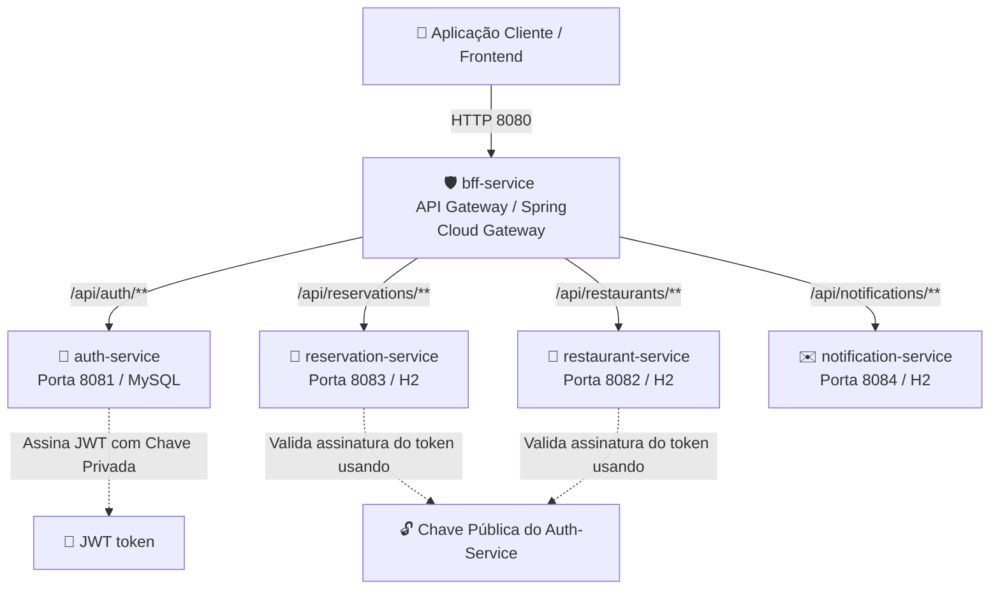

# 🍽️ FoodTableExpress - Sistema de Reservas de Mesas em Restaurantes

O **FoodTableExpress** é uma plataforma robusta e escalável desenvolvida sob a arquitetura de **microserviços** para gerenciar reservas de mesas em restaurantes. O sistema permite que clientes encontrem estabelecimentos, façam reservas, recebam notificações em tempo real e gerenciem seus perfis com segurança.

---

## 📐 Arquitetura do Sistema

O sistema é composto por 5 microserviços integrados, cada um com uma responsabilidade única no domínio de negócios. O acesso externo ao ecossistema é unificado através de uma API Gateway (BFF).



---

## 📂 Módulos do Sistema

| Microserviço | Porta | Banco de Dados | Descrição |
| :--- | :--- | :--- | :--- |
| **[bff-service](file:///c:/Users/User/Documents/projects/FoodTableExpress/bff-service)** | `8080` | Nenhum (Gateway) | **API Gateway** unificado usando Spring Cloud Gateway. Centraliza as chamadas do cliente e as roteia para os serviços internos apropriados. |
| **[auth-service](file:///c:/Users/User/Documents/projects/FoodTableExpress/auth-service)** | `8081` | MySQL (com Liquibase) | **Serviço de Autenticação**. Gerencia usuários, criptografa senhas com BCrypt e emite tokens de acesso JWT usando o par de chaves assimétricas **RS256**. |
| **[restaurant-service](file:///c:/Users/User/Documents/projects/FoodTableExpress/restaurant-service)** | `8082` | MySQL (com Liquibase) | **Serviço de Estabelecimentos**. Gerencia o cadastro de restaurantes, cardápios, endereços e mesas disponíveis. |
| **[reservation-service](file:///c:/Users/User/Documents/projects/FoodTableExpress/reservation-service)** | `8083` | H2 (Local/Memória) | **Serviço de Reservas**. Controla a lógica de reserva de mesas, datas, horários e capacidades dos estabelecimentos. |
| **[notification-service](file:///c:/Users/User/Documents/projects/FoodTableExpress/notification-service)** | `8084` | H2 (Local/Memória) | **Serviço de Notificações**. Responsável pelo envio de e-mails, SMS ou push para confirmar, cancelar ou lembrar os usuários de suas reservas. |

---

## 🔒 Fluxo de Segurança Unificado (OAuth2 & JWT)

O sistema adota segurança distribuída sem estado (*stateless*):
1. O cliente faz a requisição de login enviando e-mail e senha para o Gateway (`POST http://localhost:8080/api/auth/token`).
2. O `bff-service` repassa a chamada para o **`auth-service`**, que valida as credenciais contra a base MySQL.
3. Se válido, o `auth-service` assina um token JWT com sua **chave privada** ([app.key](file:///c:/Users/User/Documents/projects/FoodTableExpress/auth-service/src/main/resources/app.key)) e devolve ao cliente.
4. Para as requisições subsequentes a rotas protegidas (ex: fazer uma reserva), o cliente anexa o token no header (`Authorization: Bearer <TOKEN>`).
5. Os microserviços internos decodificam e validam a assinatura do token localmente usando a **chave pública** ([app.pub](file:///c:/Users/User/Documents/projects/FoodTableExpress/auth-service/src/main/resources/app.pub)), sem precisar consultar o `auth-service`.

---

## 🛠️ Como Executar o Projeto Localmente

### 1. Inicializar a Infraestrutura (MySQL)
Na raiz do projeto, inicie o banco de dados MySQL via Docker Compose:

```bash
docker-compose up -d mysql
```

### 2. Gerar o Par de Chaves RSA (Se necessário)
O `auth-service` necessita das chaves pública e privada para funcionar. Caso precise gerá-las, siga as instruções no [README do auth-service](file:///c:/Users/User/Documents/projects/FoodTableExpress/auth-service/README.md#L64).

### 3. Compilar e Executar os Serviços
Você pode executar cada microserviço a partir de sua IDE favorita (VS Code, IntelliJ ou Eclipse) executando a classe principal `*Application.java` de cada pasta correspondente.

A ordem recomendada de inicialização é:
1.  **`auth-service`** (Porta `8081`) - Inicializa o banco de dados e as tabelas via Liquibase.
2.  **`restaurant-service`** (Porta `8082`)
3.  **`reservation-service`** (Porta `8083`)
4.  **`notification-service`** (Porta `8084`)
5.  **`bff-service`** (Porta `8080`) - Gateway de entrada.

---

## 📈 Monitoramento e Observabilidade

Todos os microserviços contam com suporte ao **Spring Boot Actuator** para verificar a integridade da aplicação de forma distribuída:
*   Métrica de saúde do Gateway: `http://localhost:8080/actuator/health`
*   Métrica de saúde da Autenticação: `http://localhost:8081/actuator/health`
*   Métrica de saúde dos Restaurantes: `http://localhost:8082/actuator/health`
*   Métrica de saúde das Reservas: `http://localhost:8083/actuator/health`
*   Métrica de saúde das Notificações: `http://localhost:8084/actuator/health`
